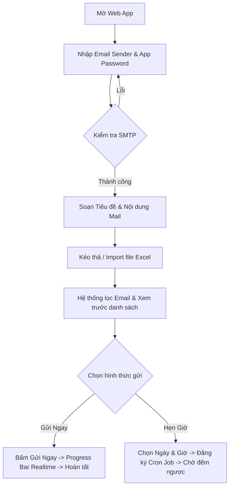

# 🎨 DESIGN: Bulk Email Sender (Ứng Dụng Web Gửi Mail Hàng Loạt & Hẹn Giờ)

Ngày tạo: 2026-08-14  
Dựa trên: [plan.md](file:///c:/Henry%20Web%20+%20App/bulk-email-sender/plans/260814-bulk-mail-sender/plan.md) và [BRIEF.md](file:///c:/Henry%20Web%20+%20App/bulk-email-sender/docs/BRIEF.md)  

---

## 1. CẤU TRÚC LƯU TRỮ DỮ LIỆU (Database & Data Models)

### Bảng 1: `campaigns` (Danh sách đợt gửi mail)
- `id`: Mã định danh đợt gửi (UUID / String).
- `sender_email`: Email người gửi.
- `subject`: Tiêu đề email.
- `body`: Nội dung HTML/văn bản email.
- `status`: Trạng thái (`draft`, `scheduled`, `sending`, `completed`, `cancelled`).
- `scheduled_at`: Thời gian hẹn giờ gửi (ISO Timestamp hoặc Null nếu gửi ngay).
- `created_at`: Ngày tạo.

### Bảng 2: `recipients` (Danh sách email nhận)
- `id`: ID email nhận.
- `campaign_id`: Khóa ngoại liên kết đợt gửi (`campaigns.id`).
- `email`: Địa chỉ email nhận (đọc từ Excel).
- `status`: Trạng thái gửi (`pending`, `sent`, `failed`).
- `error_message`: Lý do thất bại (nếu có).
- `sent_at`: Thời gian gửi thành công.

---

## 2. DANH SÁCH MÀN HÌNH UI & COMPONENT CHÍNH

| # | Tên Component | Chức Năng & Thao Tác |
|---|---|---|
| 1 | **Header & SMTP Config** | Nhập Sender Email, Mật khẩu ứng dụng (App Password), Nút `Verify SMTP`. |
| 2 | **Mail Composer Form** | Ô nhập Tiêu đề Subject, Soạn thảo nội dung Rich Text/HTML. |
| 3 | **Excel Drag & Drop Importer** | Tải file `.xlsx`/`.csv`, tự động trích xuất danh sách email và hiển thị Bảng Xem trước. |
| 4 | **Scheduler & Action Switcher** | Tùy chọn nút "Gửi Ngay" hoặc "Hẹn Giờ Gửi" (Date & Time Picker). |
| 5 | **Progress & Log Modal** | Thanh tiến trình gửi %, đếm số mail Thành công/Thất bại & Nhật ký chi tiết. |

---

## 3. CỔNG KẾT NỐI API (API Endpoints Contract)

| Method | Endpoint | Mục Đích | Body Payload | Response |
|---|---|---|---|---|
| `POST` | `/api/smtp/verify` | Kiểm tra tài khoản SMTP | `{ senderEmail, appPassword }` | `{ success: true, message: "SMTP Connected" }` |
| `POST` | `/api/email/send-now` | Thực hiện gửi mail ngay | `{ sender, subject, body, recipients }` | `{ campaignId, totalRecipients }` |
| `POST` | `/api/email/schedule` | Lập lịch hẹn giờ gửi | `{ sender, subject, body, recipients, scheduledAt }` | `{ campaignId, scheduledAt, status: "scheduled" }` |
| `GET` | `/api/email/schedules` | Truy vấn danh sách lịch hẹn | - | `[{ id, subject, scheduledAt, totalRecipients }]` |
| `DELETE`| `/api/email/schedules/:id`| Hủy bỏ lịch hẹn gửi | - | `{ success: true, message: "Job Cancelled" }` |

---

## 4. LUỒNG HOẠT ĐỘNG NGƯỜI DÙNG (User Flow)

---

## 5. KỊCH BẢN KIỂM THỬ (Acceptance Criteria & Test Cases)

- **TC-01 (Happy Path - Gửi Ngay):** Nhập đúng SMTP, tiêu đề/nội dung, import 5 email Excel -> Bấm Gửi Ngay -> Progress Bar chạy từ 0% đến 100% -> 5 mail được gửi thành công.
- **TC-02 (Happy Path - Hẹn Giờ):** Đặt lịch hẹn gửi sau 5 phút -> Hệ thống lưu job -> Đúng 5 phút sau server tự động gửi mail và cập nhật trạng thái `completed`.
- **TC-03 (Validation - Sai SMTP):** Nhập sai App Password -> Bấm Verify -> Hiển thị thông báo lỗi chi tiết.
- **TC-04 (Validation - Excel lỗi):** Import file không có cột Email -> Hệ thống cảnh báo "Không tìm thấy danh sách email hợp lệ".
